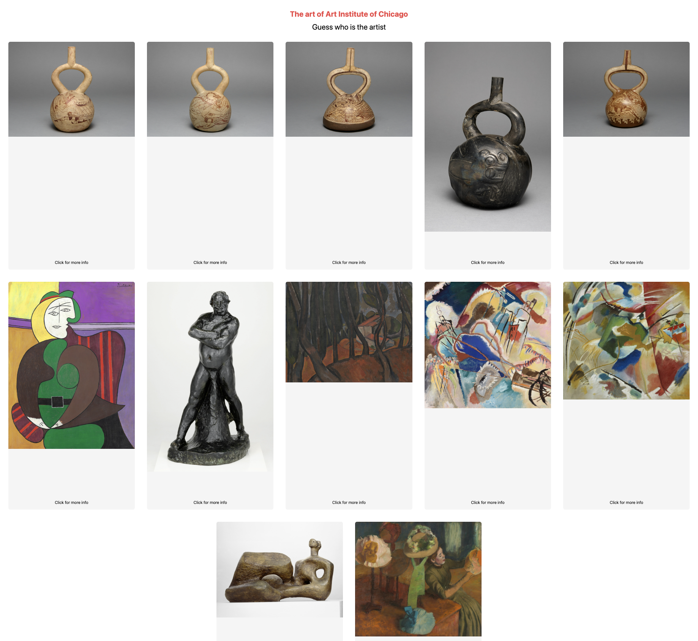

# Welcome to Chicago Art!

Explore Chicago's curated art collection interactively – guess the artist, click to reveal, and immerse yourself in the stories behind each masterpiece.




## Project Description

This project leverages the [Art Institute of Chicago API](https://api.artic.edu/docs/#introduction) to offer an interactive exploration of curated art. It was built using modern technologies including [Vite](https://vitejs.dev/guide/), [React Router DOM](https://reactrouter.com/en/main), [React Query](https://tanstack.com/query/latest/docs/framework/react/overview), [TypeScript](https://www.typescriptlang.org/), and [Tailwind CSS](https://tailwindcss.com/), combining efficiency and responsiveness for an engaging user experience.

## Dependencies and Installing

### Clone this repository:
```sh
git clone https://github.com/claudiahalip/Chicago-Art-App.git
```

### Node.js
- use `v20.11.0` node version

```sh
nvm use v20.11.0
```

### Install NPM packages

```sh
npm i
```

### Run the dev server:

```sh
npm run dev
```

Experience the app live at http://localhost:5173/.

Run test:
```sh 
npm run test
```


